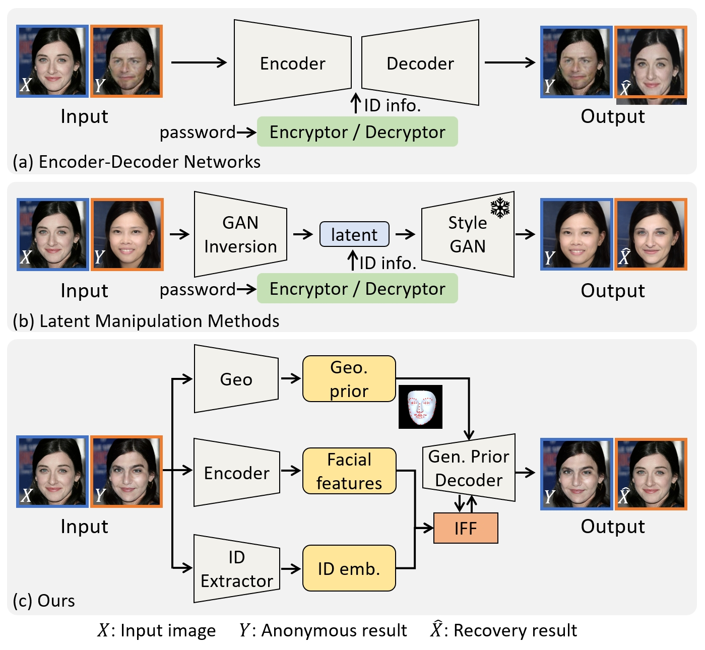
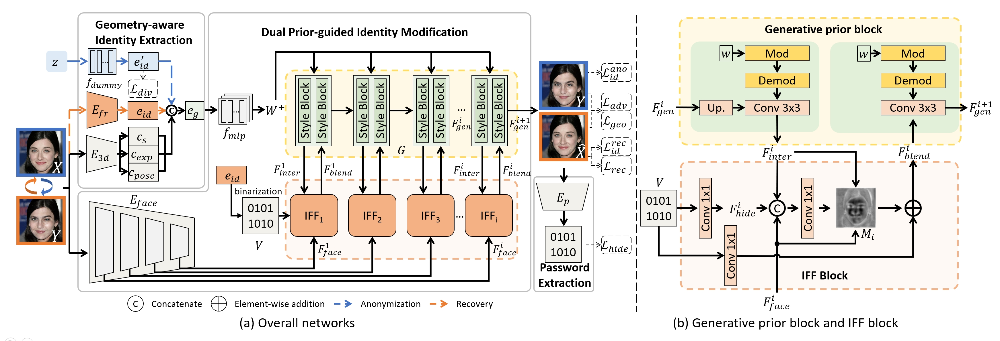

## G<sup>2</sup>Face: High-Fidelity Reversible Face Anonymization via Generative and Geometric Priors<br><sub>Official PyTorch Implementation</sub>

This repo contains the training and inference code for our G<sup>2</sup>Face paper.

> **G<sup>2</sup>Face: High-Fidelity Reversible Face Anonymization via Generative and Geometric Priors**
[| *arxiv* |](https://arxiv.org/abs/2408.09458) [ *ieeexplore* | ](https://ieeexplore.ieee.org/document/10644096)<br>
> Haoxin Yang, Xuemiao Xu, Cheng Xu, Huaidong Zhang, Jing Qin, Yi Wang, Pheng-Ann Heng, Shengfeng He\
> <br>South China University of Technology, The Hong Kong Polytechnic University, Dongguan University of Technology,  The Chinese University of Hong Kong, Singapore Management University.<br>

## Abstract
<p align="center">

</p>

<br>
&emsp;&emsp;Reversible face anonymization, unlike traditional face pixelization, seeks to replace sensitive identity information in facial images with synthesized alternatives, preserving privacy without sacrificing image clarity. Traditional methods, such as encoder-decoder networks, often result in significant loss of facial details due to their limited learning capacity. Additionally, relying on latent manipulation in pre-trained GANs can lead to changes in ID-irrelevant attributes, adversely affecting data utility due to GAN inversion inaccuracies.
This paper introduces G<sup>2</sup>Face, which leverages both generative and geometric priors to enhance identity manipulation, achieving high-quality reversible face anonymization without compromising data utility. We utilize a 3D face model to extract geometric information from the input face, integrating it with a pre-trained GAN-based decoder. This synergy of generative and geometric priors allows the decoder to produce realistic anonymized faces with consistent geometry.
Moreover, multi-scale facial features are extracted from the original face and combined with the decoder using our novel identity-aware feature fusion blocks (IFF). This integration enables precise blending of the generated facial patterns with the original ID-irrelevant features, resulting in accurate identity manipulation.
Extensive experiments demonstrate that our method outperforms existing state-of-the-art techniques in face anonymization and recovery, while preserving high data utility.


<p align="center">

</p>


## Installation
```
pip install -r requirements.txt 
```
Then download the weights at [Google Drive](https://drive.google.com/drive/folders/1dp4RyL5Z_28rxzyPCll_6gcIgf-J-feV?usp=sharing) or [Baidu Netdisk](https://pan.baidu.com/s/1xtdfjPp0rU3uxBjST_BW8g?pwd=rrbi) and move them to [weights/](weights/) and [model/d3dfr/BFM/](model/d3dfr/BFM).
## Training
```
sh ./train.sh
```

## Test
```
python test.py --celebahq_path YOUR_CELEBAHQ_PATH 
```

## Acknowledgement
This repository borrows from [stylegan2-pytorch](https://github.com/rosinality/stylegan2-pytorch), [insightface](https://github.com/deepinsight/insightface) and [Deep3DFaceRecon_pytorch](https://github.com/sicxu/Deep3DFaceRecon_pytorch).

We thank for their great work and sharing code.

## License
This project is released under the MIT license. Please see the [LICENSE](LICENSE) file for more information.

## Citation
If you find this repository helpful, please consider citing:
```bibtex
@article{Yang2024G2face,
  author={Yang, Haoxin and Xu, Xuemiao and Xu, Cheng and Zhang, Huaidong and Qin, Jing and Wang, Yi and Heng, Pheng-Ann and He, Shengfeng},
  journal={IEEE Transactions on Information Forensics and Security}, 
  title={G2Face: High-Fidelity Reversible Face Anonymization via Generative and Geometric Priors}, 
  year={2024},
  doi={10.1109/TIFS.2024.3449104}}
}
```
